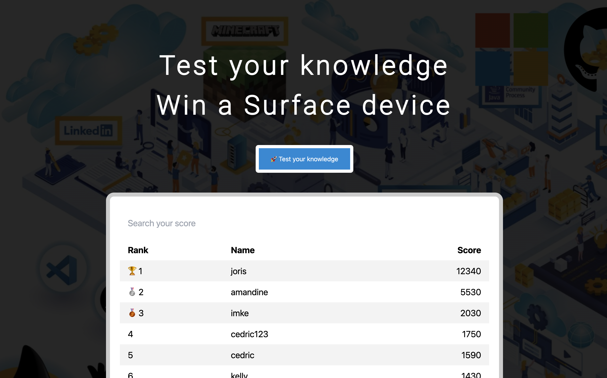
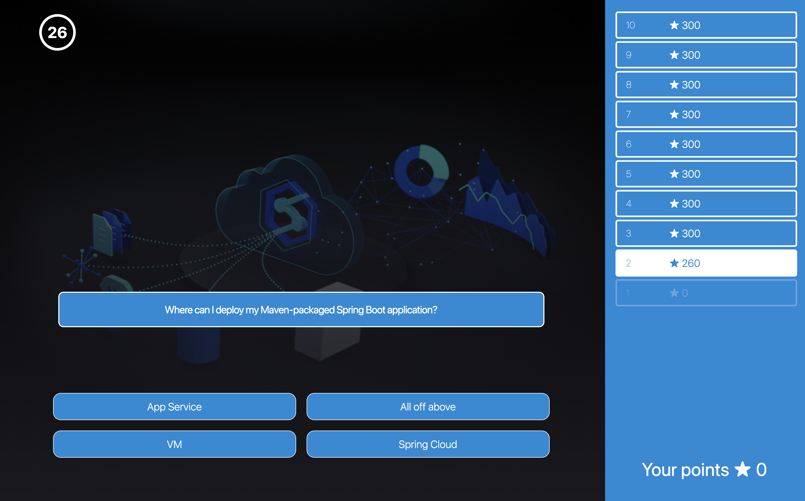
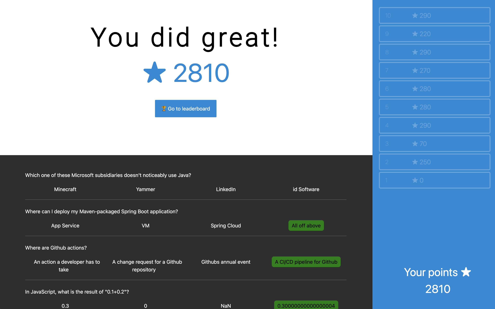

# Quiz game
This is a quiz game with a leaderboard. The idea is that question are answered within a predefined time, the longer it takes to answer the less points you can earn. Faulty answers do not get any points.

Once finished your score will be shown on the leaderboard.

## UI 

### Leaderboard:
The leader board will show the ranking of all players.

### Quiz and questions:
A user has to answer 10 random questions, the faster he answers the more points he will be granted for a correct answer.

### Overview page
On the overview page you are able to review your answers.

## Develop

1. Clone on your local machine by using https://github.com/azure-for-everyone/online-quiz-game-react
2. Navigate into the main directory
3. Run `yarn` to install node modules
4. Run `yarn start` to run it locally then will open automatclly on your browser on localhost:3000 port

